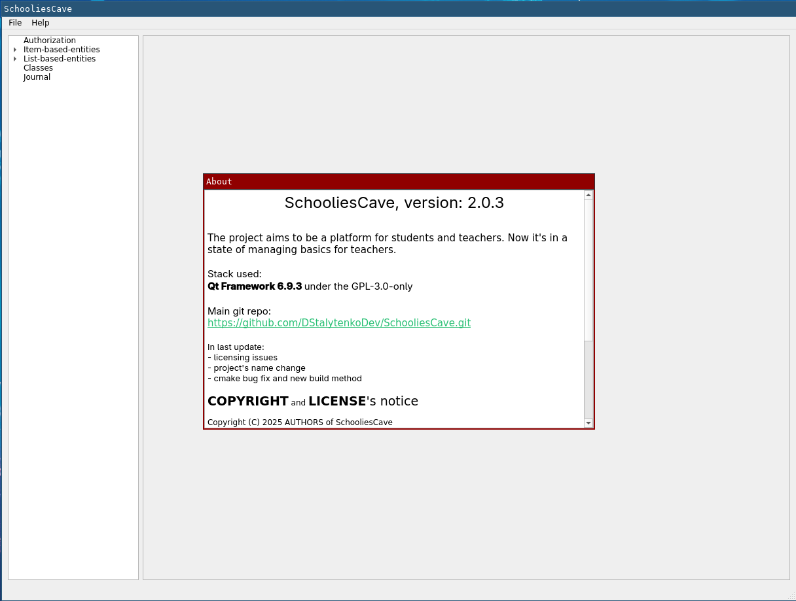
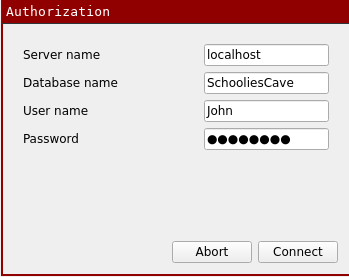
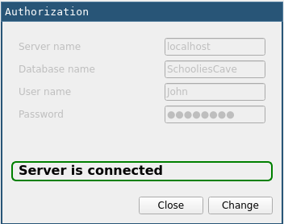
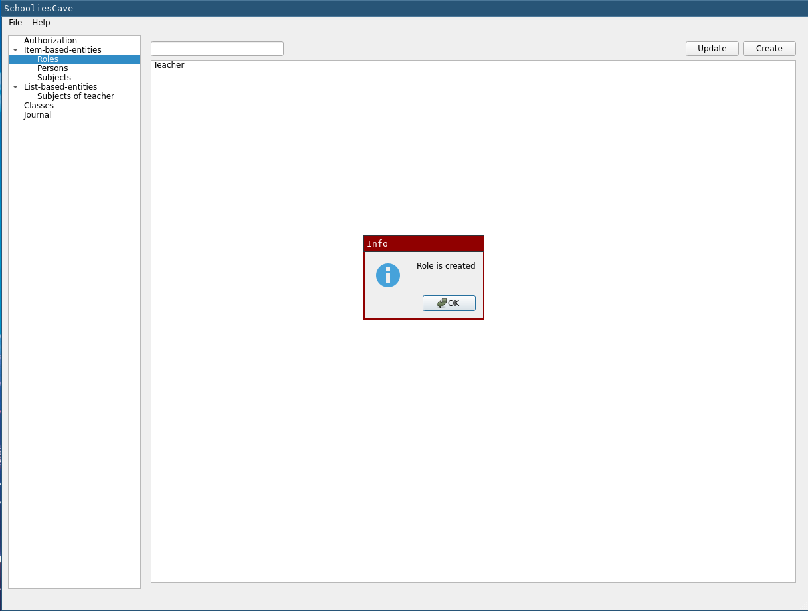
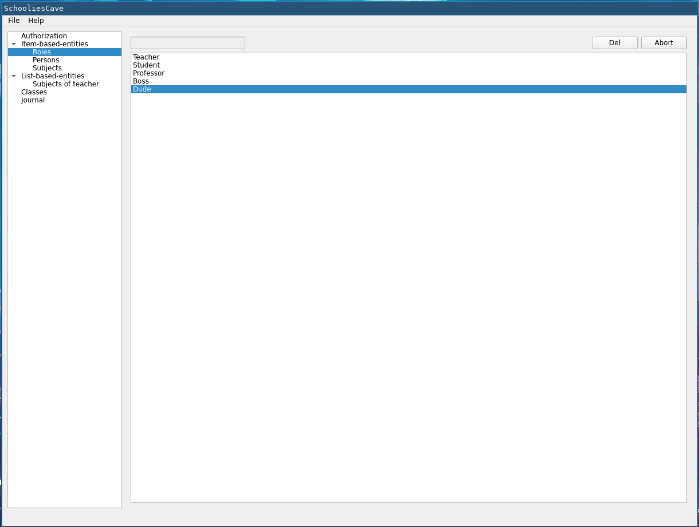
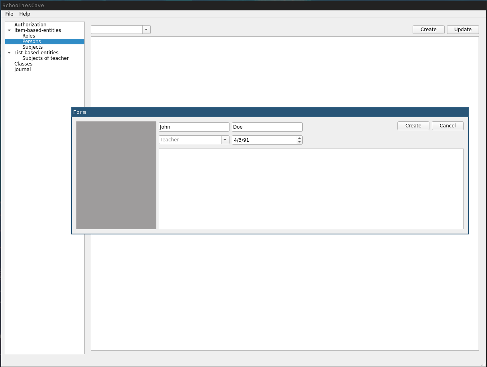
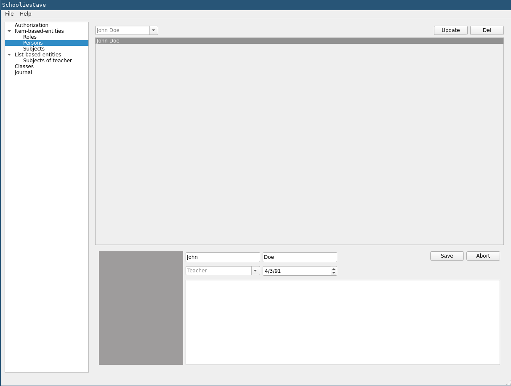
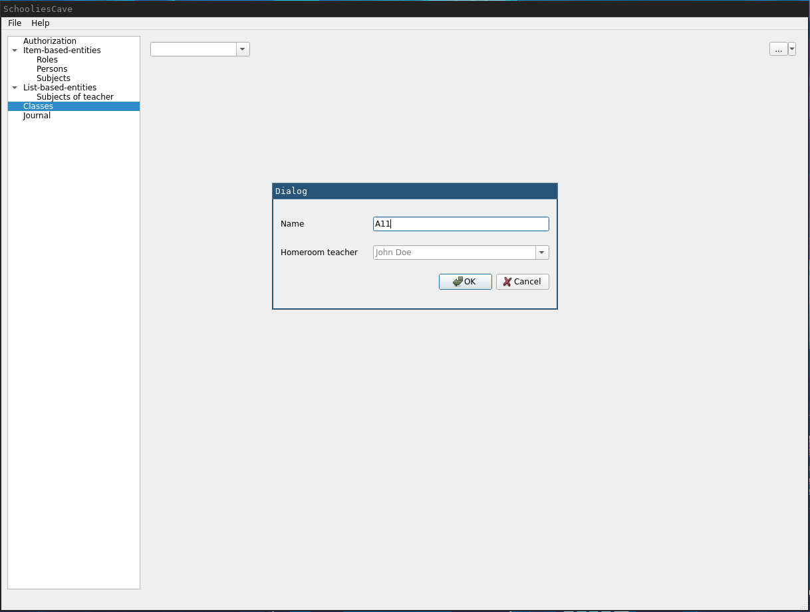
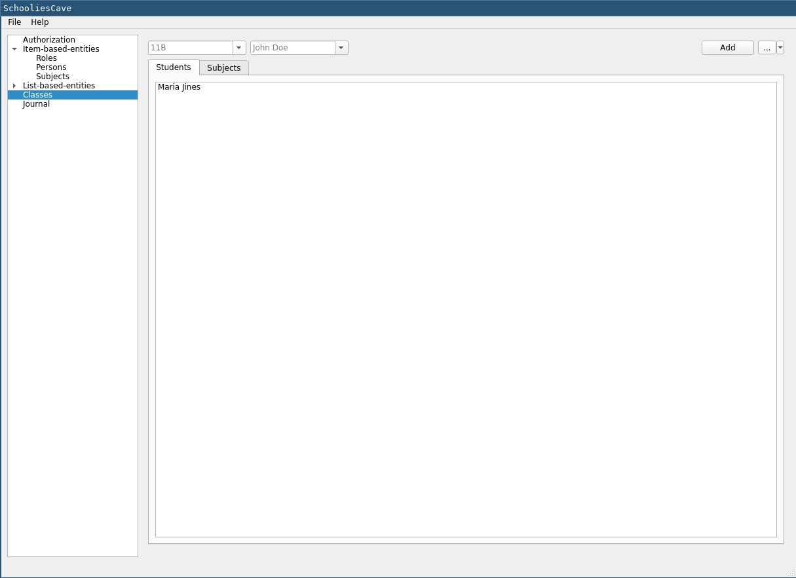
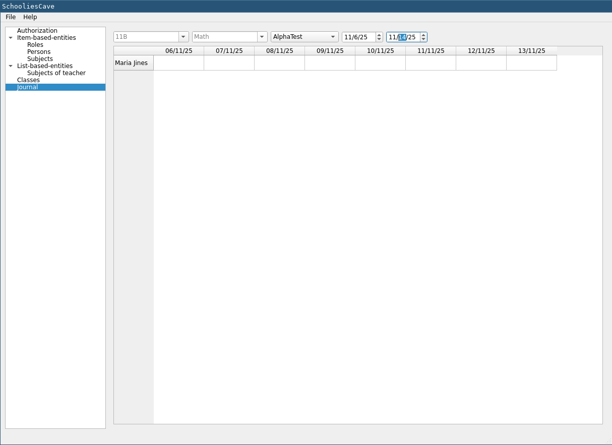

# Here is how the SchooliesCave looks like
**That is not the whole app, these pictures just show the general complexity of the app**

### About dialog

### The authorization dialog

### After successful authorization

### After role created

### Roles

### Person creation

### Edit/View/remove person

### Class creation

### Class viewing

### Journal viewing/edit

